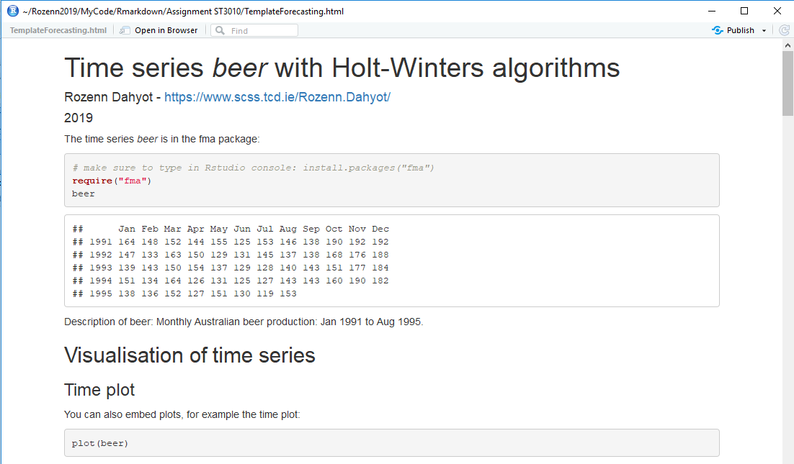

# Forecasting-with-R
Rmd file for teaching forecasting 
* [TemplateForecasting.Rmd](TemplateForecasting.Rmd) is an example of Rmd file that can be processed with RStudio. It is an example of analysis of a time series with Holt-Winters algorithms.  
* The output file is in html format ([TemplateForecasting.html](TemplateForecasting.html)) that is readable with any browser (e.g. Chrome / Internet explorer / Qwant/...).
* some help is provided in the file [HelpTemplateForecastingRmd.pdf](HelpTemplateForecastingRmd.pdf)

Other Rmd files
* [TSD.Rmd](TSD.Rmd)  time series differencing:  illustrations using arima.sim
* [ARmodels.Rmd](ARmodels.Rmd) AR models and Yule-Walker  equations.
* [DowjonesAR1D1.Rmd](DowjonesAR1D1.Rmd)  selecting an ARIMA(p,d,q) for  a time series and computing forecasts.

R file for teaching forecasting 
* [SimulationSeasonalArima.R](SimulationSeasonalArima.R) allows to create seasonal arima time series and see their resulting ACF and PACF plots. 

Information relating to my forecasting class (including lecturenotes) can be found in the teaching section of my website https://www.scss.tcd.ie/Rozenn.Dahyot/ .

